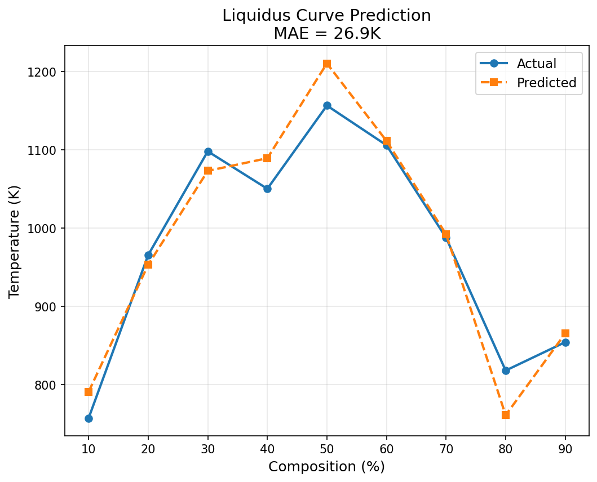

## Machine Learning for Phase Diagram Prediction

Predicting material properties from chemical composition using ML.

---

## What I Built

Trained three machine learning models to predict **eutectic temperatures**, **phase complexity** and **full liquidus curves** in binary metal alloys using XGBoost and 145+ engineered features from elemental properties(matminer library).

---

## Results

### Model 1: Eutectic Temperature Prediction
**R² = 0.867** | **Average Error: 125K**

- Predicts melting points for alloy systems
- 87% of variation explained by the model
- Uses elemental properties (electronegativity, atomic radius, etc.)
- **Key insight:** Successfully identifies low-melting compositions without phase information

## Model 2: Phase Complexity Prediction  
**R² = 0.6933**

- Predicts number of phases in binary systems
- Could help screen alloy candidates before experiments
- **Challenge:** Discrete values (1, 2, 3, 4 phases) make this inherently harder than continuous predictions
- Improved from R² = 0.64 → 0.69 through hyperparameter tuning
  
## Model 3: Liquidus Curve Prediction  
**R² = 0.80** | **Average Error: 165K per point**

- **Predicts complete liquidus curves** - 9 temperatures at compositions from 10% to 90%
- Multi-output regression: one model predicts 9 values simultaneously
- **Applications:** 
  - Design casting processes (predict melting behavior across composition range)
  - Optimize alloy composition without full experimental phase diagram
- **Technical approach:** `MultiOutputRegressor` wrapper with XGBoost base models

---

## Tech Stack

**Languages & Libraries:**
- Python: scikit-learn, XGBoost, LightBGM, pandas, numpy, matplotlib
  
**ML Techniques:**
- Gradient boosting regression (XGBoost)
- Multi-output regression (liquidus curves)
- Ensemble methods (combining multiple models)

**Data:**
- 1,573 high-quality binary phase diagrams from MPDS.io
- Cleaned from 9,200+ raw samples → 1,573 usable systems
- 145 engineered features per system

---

## Key Skills I Learned
- Data preprocessing and cleaning (~9200-> ~1500 samples)
- Feature engineering from materials data  
- Machine learning regression (XGBoost)
- Trained models to predict 9 simultaneous outputs (liquidus curves) 
- Avoiding data leakage  
- Model evaluation and visualization  
- Hyperparameter tuning (0.64 → 0.6933 R²)  
