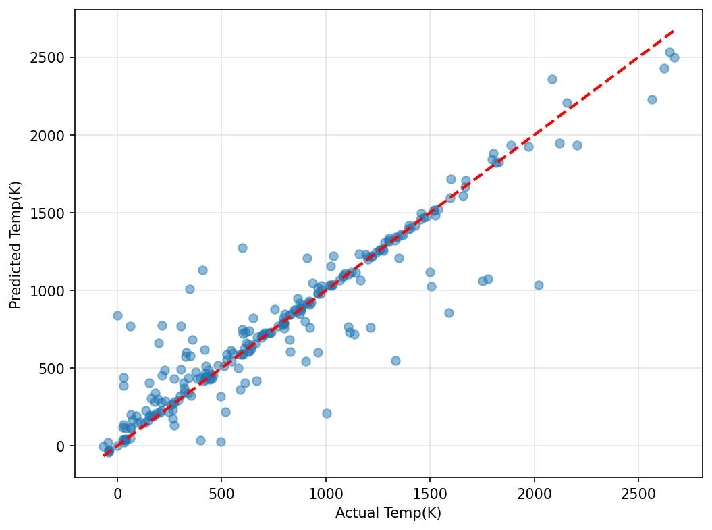

## Machine Learning for Phase Diagram Prediction

Predicting material properties from chemical composition using ML.

---

## What I Built

Trained machine learning models to predict **eutectic temperatures** and **phase complexity** in binary metal alloys using XGBoost and 145+ engineered features from elemental properties.

---

## Results

### Model 1: Eutectic Temperature Prediction
**R² = 0.867** | **Average Error: 125K**

- Predicts melting points for alloy systems
- 87% of variation explained by the model
- Uses elemental properties (electronegativity, atomic radius, etc.)

## Model 2: Phase Complexity Prediction  
**R² = 0.6933**

- Predicts number of phases in binary systems
- Could help screen alloy candidates before experiments

---

## Tech Stack

- Python: scikit-learn, XGBoost, pandas, numpy
- Feature Engineering: matminer (145 features)
- Data: - 1,573 binary phase diagrams

---

## Key Skills I Learned
Data preprocessing and cleaning (~9200 samples-> ~1500 best samples)
Feature engineering from materials data  
Machine learning regression (XGBoost)  
Avoiding data leakage  
Model evaluation and visualization  
Hyperparameter tuning (0.64 → 0.6933 R²)  
